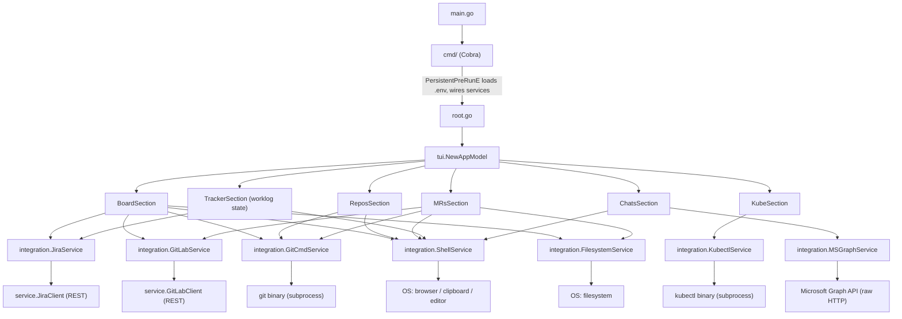
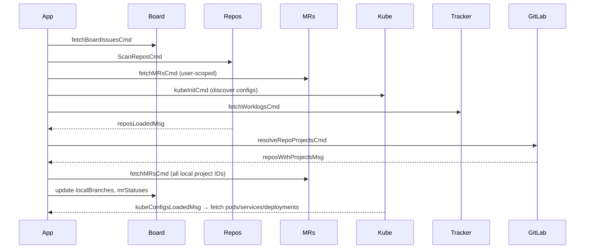

# Architecture

jirlab is a terminal user interface (TUI) for managing Jira issues, GitLab merge requests, and Kubernetes resources.

## Technology Stack

| Layer | Technology |
|---|---|
| CLI framework | [Cobra](https://github.com/spf13/cobra) |
| TUI framework | [Bubble Tea](https://github.com/charmbracelet/bubbletea) |
| TUI styling | [Lip Gloss](https://github.com/charmbracelet/lipgloss) |
| Config loading | [Viper](https://github.com/spf13/viper) via godotenv |
| Logging | [zap](https://github.com/uber-go/zap) |
| Jira API | REST API v2/v3 |
| GitLab API | REST API v4 |
| Kubernetes | `kubectl` CLI subprocess |

---

## Layered Architecture

```
┌──────────────────────────────────────────────────────┐
│  cmd/           CLI entry points (Cobra)             │
├──────────────────────────────────────────────────────┤
│  internal/tui/  Bubble Tea UI sections               │
│                 (board, repos, mrs, kube, chats)     │
├──────────────────────────────────────────────────────┤
│  internal/integration/  External service interfaces  │
│    JiraService       — Jira use-cases                │
│    GitLabService     — GitLab use-cases              │
│    GitCmdService     — git subprocess abstraction    │
│    KubectlService    — kubectl subprocess abstraction│
│    FilesystemService — file write abstraction        │
│    ShellService      — browser / clipboard / editor  │
│    MSGraphService    — Microsoft Graph API (Teams)   │
├──────────────────────────────────────────────────────┤
│  internal/service/  HTTP clients + domain models     │
│    JiraClient     — REST calls to Jira               │
│    GitLabClient   — REST calls to GitLab             │
│    ScanRepos      — filesystem/git repo scanner      │
└──────────────────────────────────────────────────────┘
```

The **TUI layer** only calls **integration interfaces** — never external processes directly.
The **integration layer** wraps all subprocess calls (git, kubectl), HTTP clients, and OS-specific operations (clipboard, browser, editor resolution).
The **service layer** holds domain models and HTTP client implementations.

See [ADR 002](adr/002-integration-layer.md) for the rationale behind this pattern.
See [ADR 004](adr/004-msgraph-integration.md) for the MS Graph integration decision.

---

## Component Overview



---

## Data Flow

### Startup



### MR Discovery

All open MRs are fetched for every resolved local GitLab project (`GET /projects/:id/merge_requests`) and merged with user-scoped MRs (`scope=created_by_me` + `scope=assigned_to_me`). Duplicates are deduplicated by MR ID.

### Shell Navigation

The TUI cannot change its parent shell's `CWD`. When the user presses `n`/`enter` on a repository:

1. The target path is written to `/tmp/jirlab_nav` via `integration.GitCmdService.WriteNavPath`.
2. `tea.QuitMsg{}` is returned — the TUI exits cleanly.
3. The shell wrapper function (see README) reads `/tmp/jirlab_nav` after exit and runs `cd`.

### Git Push (`g` key)

Pressing `g` on the Repositories tab calls `integration.GitCmdService.StageAllCommitPush(repoPath, message)` which runs:
1. `git add -A` — stage all changes
2. `git commit -m <message>` — commit
3. `git push` — push; if the branch has no upstream tracking ref (stderr contains "no upstream" / "The current branch"), automatically retries with `git push --set-upstream origin <branch>`

### Kubernetes Refresh

The KubeSection auto-refreshes every 10 seconds via a `kubeRefreshMsg` tick. During background refresh, existing pod/service/deployment data is kept visible. The loading spinner only appears on first load (no data yet). Manual refresh with `r` also preserves existing data while fetching.

### Version Detection

Pod versions are resolved in priority order:
1. `metadata.annotations["rollme"]`
2. `metadata.labels["app.kubernetes.io/version"]`
3. `metadata.labels["rollme"]`
4. Container image tag (after last `:`)

### Pod Status

Pod status shows the container's `state.waiting.reason` or `state.terminated.reason` (e.g. `CrashLoopBackOff`, `OOMKilled`) when available, falling back to the pod phase (`Running`, `Pending`, etc.).

**Pod status colour coding:**

| Colour | Status |
|--------|--------|
| Green | Running |
| Yellow | Pending / Initialising |
| Red | Error / CrashLoopBackOff / OOMKilled / failed |
| Grey | Completed / Succeeded (terminated normally) |
| White | Unknown / other |


---

## Directory Structure

```
cmd/                    Cobra CLI entry points
internal/
  config/               Viper-based config loader
  service/              GitLab & Jira REST API clients + domain models
  integration/          External service interfaces + adapters
                          (JiraService, GitLabService, GitCmdService,
                           KubectlService, FilesystemService, ShellService,
                           MSGraphService — interface + raw HTTP client)
  actions/              Issue transition helpers
  notes/                Note model, filesystem store, and migration helper
  git/                  Branch creation logic
  background/           Periodic refresh worker
  debug/                Optional debug logger
  tui/
    app.go              Root Bubble Tea model + message routing
    board.go            Sprint board tab
    repos.go            Repositories tab
    mrs.go              Merge requests tab
    kube.go             Kubernetes tab
    chats.go            Chats tab (Teams + notes/templates)
    tracker.go          Worklog state holder (used by Board l key)
    notes.go            Note helpers, message types, and modals
    modal.go            Modal overlays
    colors.go           Issue/MR/worklog/branch/pipeline colour rules
    keys.go             Help key definitions
    styles.go           Lip Gloss style constants + table separator helpers
    helpers.go          Shared TUI helpers (truncStr, openBrowserCmd, SaveTicketDescription, SaveMRPatch, etc.)
    git_ops.go          Git command tea.Cmds (checkout, branch, navigate)
    sysattr_unix.go     Platform-specific process detachment
docs/
  architecture.md       This file
  adr/                  Architecture Decision Records
    001-tui-framework.md
    002-integration-layer.md
    003-kube-exec.md
    004-msgraph-integration.md
main.go                 Entry point
features/               ATDD Godog acceptance test suites
  *.feature             Gherkin scenario files
  *_test.go             Godog step definitions + test suites
```

---

## Coloring Rules

### Sprint Board & Repositories (top table)

| Colour | Condition |
|---|---|
| Dark blue | Issue assigned to current user (board only) |
| Red | Others' MR exists, not yet approved |
| Green | My MR, approved |
| Yellow | My MR, open (not approved) |
| Orange | Others' MR, approved |
| Light blue | Local branch exists, no MR |
| White | No branch or MR |

### Repositories — Branches subtab

| Colour | Condition |
|---|---|
| Green | Active (currently checked-out) branch |
| Grey | Protected branch |
| White | Regular branch |

### Repositories — MRs subtab

| Colour | Condition |
|---|---|
| Red | Others' MR, unapproved |
| Green | My MR, approved |
| Yellow | My MR, unapproved |
| Orange | Others' MR, approved |
| Green | Source branch matches active repo branch |

### Repositories — Pipelines subtab & MRs tab pipelines

| Colour | Condition |
|---|---|
| Green | Running |
| Yellow | Pending |
| Red | Failed |
| Grey | Canceled / Skipped |

### Merge Requests Tab

| Colour | Condition |
|---|---|
| Red | Others' MR, unapproved |
| Green | My MR, approved |
| Yellow | My MR, unapproved |
| Orange | Others' MR, approved |

### Time Tracker

| Colour | Condition |
|---|---|
| Red | 0h logged |
| Yellow | > 0h and < 8h |
| Green | ≥ 8h |

---

## Async Pattern

All network calls follow the Bubble Tea command pattern:

```go
// tea.Cmd returns a tea.Msg
func fetchBoardIssuesCmd(jira integration.JiraService, boardID string) tea.Cmd {
    return func() tea.Msg {
        issues, err := jira.GetBoardIssues(boardID, service.Filter{})
        // ...
        return boardIssuesLoadedMsg{issues: issues}
    }
}
```

The root `Update` method routes each `tea.Msg` to the correct section.

---

## Architecture Decision Records

| ADR | Title |
|-----|-------|
| [ADR 001](adr/001-technology-choices.md) | Technology choices (Bubble Tea, Cobra, hand-rolled REST clients) |
| [ADR 002](adr/002-integration-layer.md) | Integration layer pattern (all external calls behind interfaces) |
| [ADR 003](adr/003-kubernetes-integration.md) | Kubernetes integration design (kubectl CLI, kubeconfig discovery, auto-refresh) |

---

## Notes Subsystem

Notes are stored as individual files under `<UserCacheDir>/jirlab/notes/` (e.g. `~/.cache/jirlab/notes/` on Linux).

### File format

Each note is a UTF-8 plain-text file (`<id>.note`) using a compact properties + body layout:

```
id=a1b2c3d4
title=My Note
category=work
priority=1
created=1714262400000000000
updated=1714262400000000000
task=t1:false:Buy groceries
task=t2:true:Do laundry
---
Description body here.
Can span multiple lines.
```

- Header lines are `key=value` (split on the first `=`).
- Task lines are `task=<id>:<done>:<text>` (split on the first two `:`; text may contain colons).
- Everything after the `---` separator line is the description body.
- Timestamps are Unix nanoseconds stored as decimal integers.

### CLI commands

| Command | Description |
|---------|-------------|
| `jirlab note add <title> [body]` | Create a note; prints the new ID |
| `jirlab note list` | List all notes (newest first) |
| `jirlab note show <id>` | Print full note content |
| `jirlab note delete <id>` | Delete a note and remove its file |

Flags for `note add`: `--category / -c`, `--priority / -p` (0=Low, 1=Med, 2=High).

### Migration

On startup the TUI automatically migrates any notes found in the legacy `~/.jirlab/notes.json` (single JSON array format) into the per-file store, then removes the old file.
